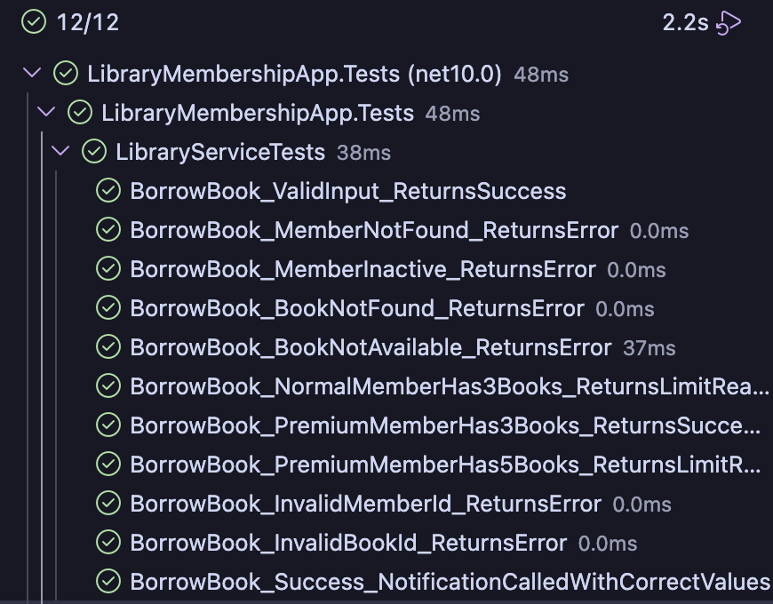

# Library Membership App

## About
Console app for managing library book borrowing with NUnit and Moq testing.

## Projects
- LibraryMembershipApp - main app
- LibraryMembershipApp.Tests - test project

## Where Moq is used
Moq is used in the test project to mock the repository and 
notification dependencies so we can test LibraryService without 
needing a real database or email service.

- IMemberRepository - mocked to return fake member data
- IBookRepository - mocked to return fake book data  
- INotificationService - mocked to verify notification is sent

## Tests
12 test cases covering success and failure scenarios

## Test Results
