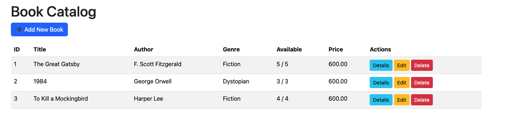

# LibraryManagement_MVC

A simple library management system built with ASP.NET Core MVC using Code First approach.

## What it does

- Add, Edit, Delete books
- View book details

## Screenshots

| Page | Screenshot |
|------|------------|
| Home Page |  |
| Book Catalog |  |
| Add Book |  |
| Edit Book |  |
| Book Details |  |
| Delete Book |  |

## Tech used

- ASP.NET Core 8
- Entity Framework Core (Code First)
- SQL Server
- Bootstrap 5

