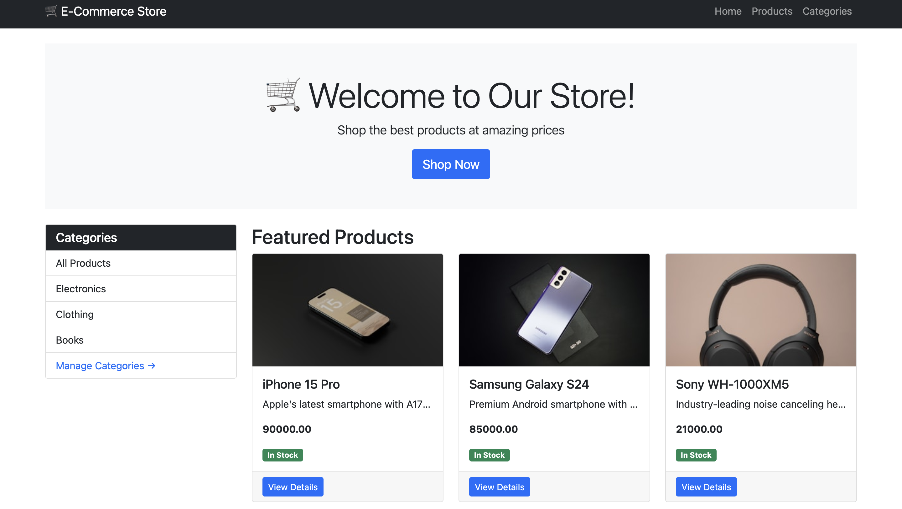
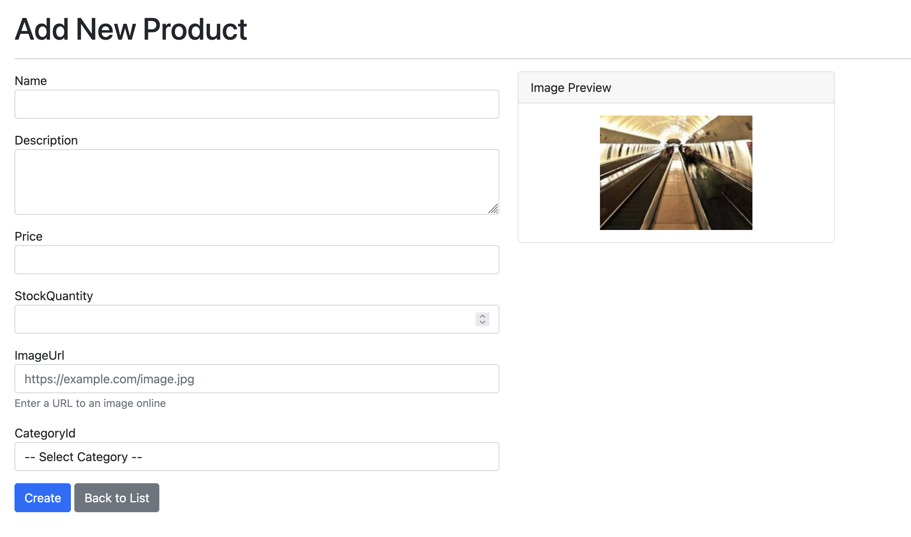
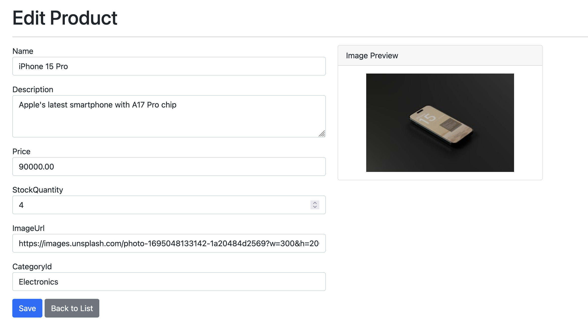
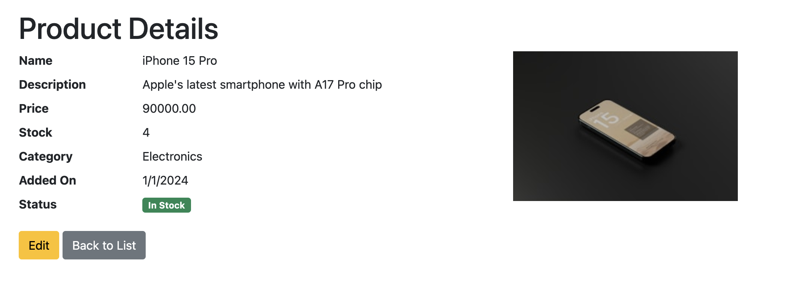
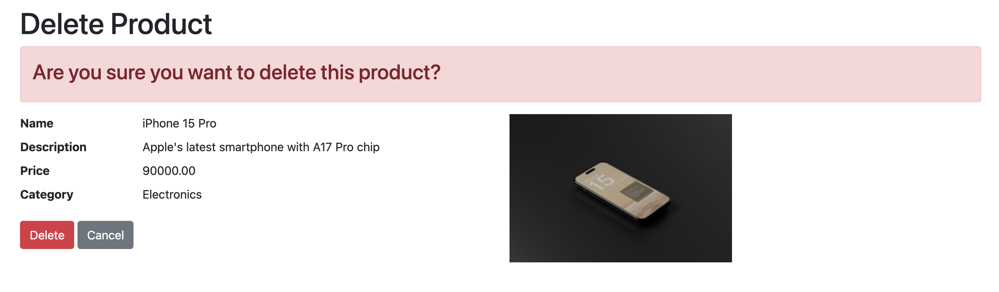

# E-Commerce Platform

Simple product management app built with ASP.NET Core MVC using Db first approach.

## What it does

- Add/Edit/Delete products and categories
- Filter products by category
- Images referenced using URLs and not direct file uploads

## What is MVC?

MVC stands for **Model-View-Controller**. It separates your app into three parts:

- **Model** → Manages data and database
- **View** → Handles what the user sees (UI)
- **Controller** → Takes user requests, processes them, and returns the response

This makes the code organized, reusable, and easier to maintain.

## Screenshots

| Page | Screenshot |
|------|------------|
| Products |  |
| Add Product |  |
| Edit Product |  |
| Product Details |  |
| Delete Product |  |

## Tech

ASP.NET Core 8 | EF Core (Code First) | SQL Server | Bootstrap 5