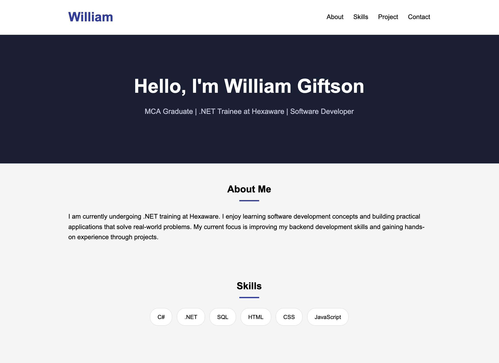

# Portfolio Page — Assignment
 
A simple one-page portfolio site built with plain HTML and CSS.

 
## What it includes
 
- Hero section with name and current role
- About me
- Skills (C#, .NET, SQL, HTML, CSS, JavaScript)
- Current journey — Hexaware .NET training
- Featured project — RoadReady (car rental system)
- Contact info
## Built with
 
- HTML5
- CSS3
