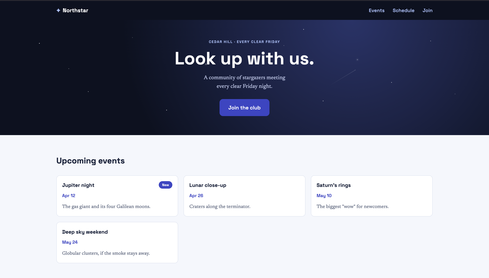

# Northstar — Cedar Hill Stargazing Club

A static, responsive landing page built for design-handoff assignment

## What it is

Northstar is a astronomy club site for a community that meets every clear Friday night at Cedar Hill. The page covers:

- A hero section with the club's pitch and a "Join the club" call to action
- An upcoming events grid (Jupiter night, Lunar close-up, Saturn's rings, Perseid meteors)
- A spring schedule table with dates, locations, and targets
- A join form (name, email, experience level, wishlist, and an opt-in checkbox)

## Built with

- Semantic HTML5
- External CSS only — no frameworks, no preprocessors
- Mobile-first layout
- CSS Grid for the events section, Flexbox for header and form layout
- A few hand-built touches: twinkling stars and shooting stars in the hero section as well as smooth anchor scrolling has  been added
