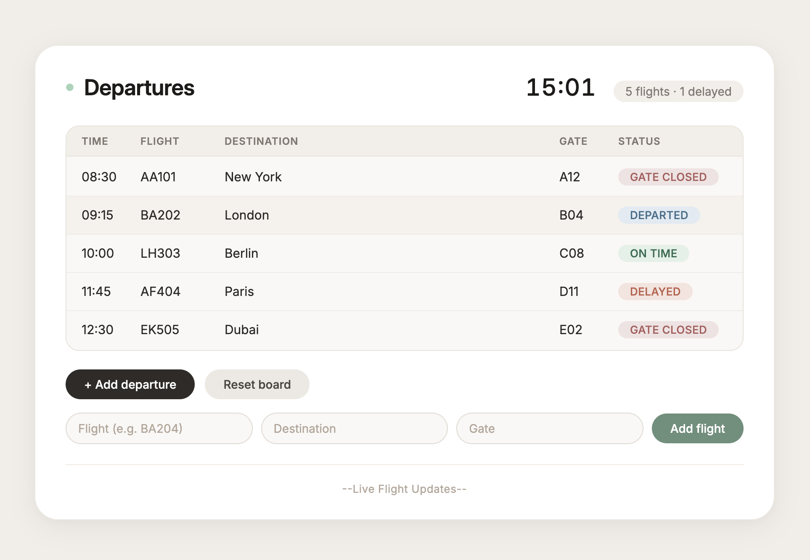

# Departures Board

A live departures board built with vanilla JavaScript. All rows are generated dynamically from data using DOM methods.

## Screenshot

## What I built

A flight departures board that displays time, flight number, destination, gate, and status. The board starts empty — every row is created by JavaScript from an array of flight objects.

## How the DOM is created and updated

- Flight data is stored in an array of objects
- `renderBoard()` loops through the array and builds each row using `document.createElement`, `textContent`, and `appendChild`
- When a flight is added, status changes, or the board is reset, `renderBoard()` re-renders the entire board
- A live clock updates every second using `setInterval`
- Statuses cycle automatically

## Challenges

- Keeping the board in sync with the data required rendering everything on every change
- Status updates needed to follow a logical progression
- Styling the board to look clean while keeping all functionality
- Persisting the board through a refresh 