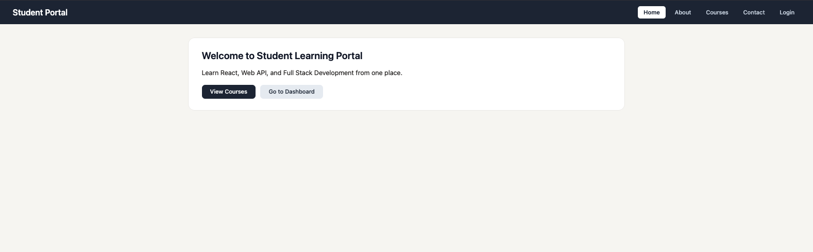
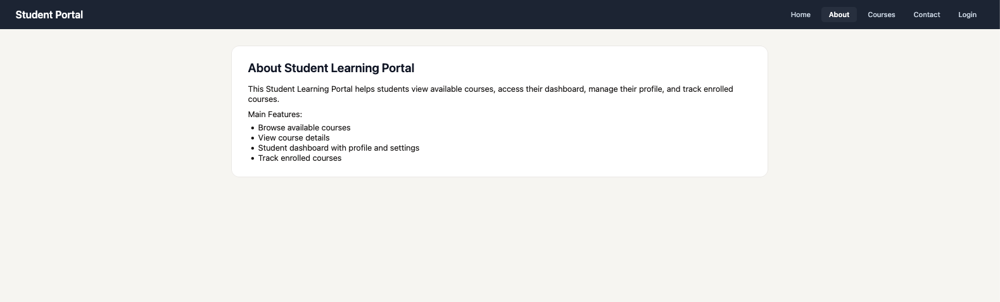
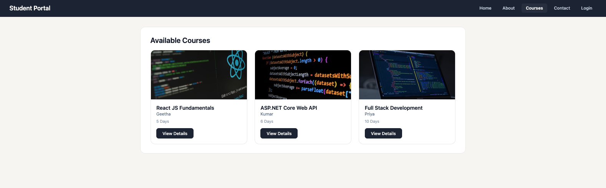
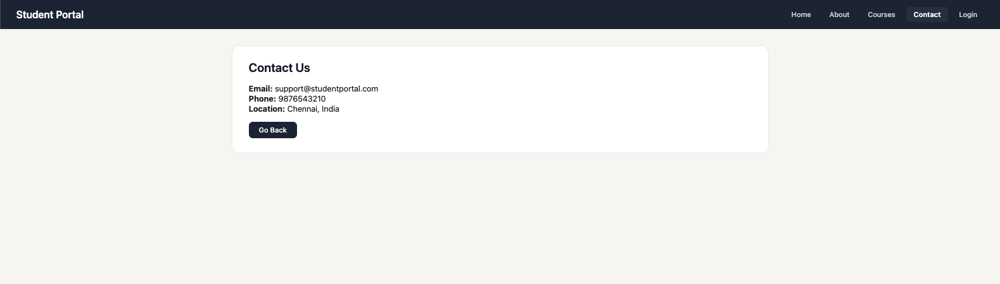
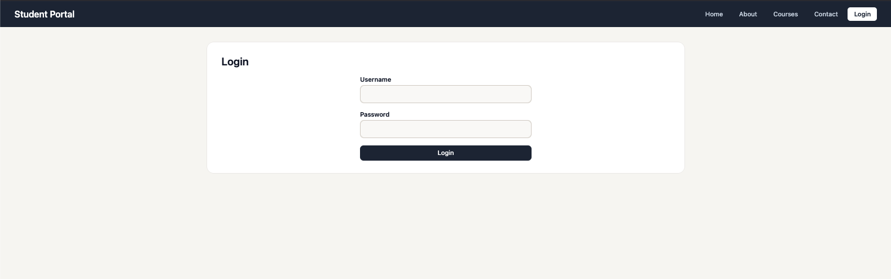
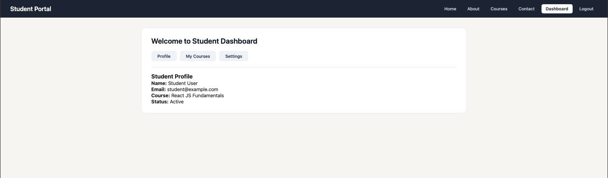

# Student Learning Portal

React Router based student portal with authentication.

## Screenshots

| Page | Screenshot |
|------|------------|
| Home |  |
| About |  |
| Courses |  |
| Contact |  |
| Login |  |
| Dashboard |  |

## What it does

- Public pages: Home, About, Courses, Contact, Login
- Private pages: Dashboard, Profile, My Courses, Settings
- View course list and click to see details
- Login with student / student123
- Logout clears session
- 404 page for invalid urls

## Routing concepts used

- Nested routes inside Dashboard
- Dynamic routes for course details
- Protected routes with redirect
- NavLink for active page highlighting
- useNavigate for buttons
- useParams to read course id from url

## Login

| Field | Value |
|-------|-------|
| Username | `student` |
| Password | `student123` |


## Run it

```bash
npm install
npm run dev